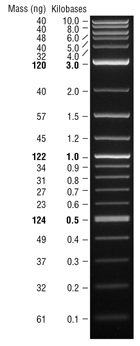

# mutants:
- GG = E64G/E143G 
- GQ = A74G/L188Q 
- GVQ = A74G/F87V/L188Q 
- IG = F81I/E143G 
- II = F162I/M237I 
- IV = F81I/E267V 
- KT2 = A191T/N239H/I259V/A276T/L353I 
- LARV = V26T/R47F/A74G/F87A/L188K 
- LF = R47L/Y51F 
- LVQ = R47L/F87V/L188Q 
- NVN = D168N/A225V/K440N 
- QM = V26T/R47F/A74G/F87V/L188K 
- QV = L188Q/E267V 
- VQ = F87V/L188Q 
- VS = F87V/P386

# individual mutations
- A191T
- A225V
- A276T
- A74G
- D168N
- E143G 
- E267V 
- E64G
- F162I
- F81I
- F87A
- F87V
- I259V
- K440N 
- L188K 
- L188Q
- L353I 
- M237I 
- N239H
- P386S
- R47F
- R47L
- V26T
- Y51F 

# 20210504 - pcr day
- most of the primers arrived

|191T|TCCATTTATTACAAGTATGGTCACCAGCTTTTACCGAGATCAGCCT           |22|
|225V|TCAAGAAGATATCAAGGTGTCCAGCTTATGATGAAAACAAGCGCCAG          |23|
|276T|TCAAATTATTACATTCTTAACGTGAGCCGCTTGATGACGAGAACATTCGC       |24|
|74G |TCAGCGTCTAATTGGGGCGCCTGGCCGTGTAACGCGCTACTTATCA           |25|
|168N|AACGCTTGATACAATAAGAGCATATTGAGGTACCGGAAGACATGACACGT       |26|
|143G|CCGTGCAGCTTAGGCAATGAAAGGCTATCATGCGATGATGGTCGATATCG       |27|
|267V|AGCCGCTTGATGACGAGAACATTCGCCCAGAAACGGGTG                  |28| ## missing
|64G |GCCTGGCCGTGTAACGCGCTACTTATCAGATCTTTAAATTCGAGG            |29|
|162I|GGAAGACATGACACGTTTAAATAATGCAGATGAGCATATTGAGGTA           |30|
|81I |ATGCGATGAATCACGCTTTGATAAAATGTCAGCGTCTAATTAAAGAA          |31|
|87A |TGATAAAAACTTAAGTCAAGCGCTGCCATGCGATGAATCACGC              |32|
|87V |TGATAAAAACTTAAGTCAAGCGCTGTCATGCGATGAATCACGC              |33|
|259V|CGGAAAAGATCCAGAAACGGGTGAGTTTATTAACGCACATGCTA             |34|
|440N|CACTTTGACTTTGAAGAGCAACGCTGGTCCTAGGTATGATGCTAAAA          |35|
|188K|TCAGCCTCATCCATTTATTACAATCGCTTTAACAGCTTTTACCGA            |36|
|188Q|TCAGCCTCATCCATTTATCATTTAACTATCGCTTTAACAGCTTTTACCGA       |37|
|353I|ATATGCAAAAGAAGATACATTATGGCCAACTGCTCCTGCGTTTTCC           |38|
|237I|ATAAAATTATTGCAGATCGCAAATCAAGGTGATGAACGACCTAGTA           |39|
|239H|TTATTGCAGATCGCAAACGATATCAAGGTGATGAACGACCTAGTAGATAAA      |40|
|47F |AGCTTTGATGAAAATTGCGGATGAATTAGGAGAAATCTTTTTACAGATAAACCGGTT|41|
|47L |AGCTTTGATGAAAATTGCGGATGAATTAGGAGAAATCTTTCAGATAAACCGGTTC  |42|
|26T |TCAGCCAAAAACGTTTGGAGAGCTTAAAACCATATGACAATTAAAGAAATG      |43|
|51F |AATTGCGGATGAATTAGGAGAAATCTTTAAATTCGATTGGTTCAAGCTTTGATG   |44|
|rev1|CCTTCAGCTGTTCCCATATTTGAACCGTATAGCACAAGCAGCGGCGTATTATGAGCG|45|
|rev2|GGAAACCGTTGTGGTCTCCCTATAGTGAGTCGTATTAATTTCGCGGGATCG      |46|
|rev3|CGTTATAAGACGCCGTTACAATTAATACAGCTCCTTCGCGCGGAAGATTTCCG    |47|

so the ones i can do today are:

- GG = E64G/E143G 
- GQ = A74G/L188Q 
- GVQ = A74G/F87V/L188Q 
- IG = F81I/E143G 
- II = F162I/M237I 
- LF = R47L/Y51F 
- LVQ = R47L/F87V/L188Q 
- NVN = D168N/A225V/K440N 
- VQ = F87V/L188Q 
- VS = F87V/P386
#### multi step:
- KT2 =  A191T/N239H/I259V/A276T/L353I 
- LARV = V26T/R47F/A74G/F87A/L188K 
- QM =   V26T/R47F/A74G/F87V/L188K 
QM & LARV - do all but F87*

### protocol
- agilent quickchange - see quickchange-multi.pdf
## quick change multi 
25µl reaction:

|10X buffer          | 2.5µl |
|ddH2O               |       |
|Quick sln           | 0-0.75 µl |
|template            | 100 ng|
|primers             | 100 ng (1-3 primers), 50 ng (4-5 primers)|
|dNTP                | 1µl |
|QuickChange enzymes | 1µl |

cycles

|segment| cycles | temp | time  |
| 1     |  1     | 95   | 1 min |
| 2     |  30    | 95   | 1 min |
|       |        | 55   | 1 min |
|       |        | 65   | 18 min| # 2min / kb - 9kb ·: 18

## quickchange lighning - quickchange-lighning.pdf

25µl
|10X buffer          | 2.5µl |
|ddH2O               |       |
|Quick sln           | 0-0.75 µl |
|template            | 10-100 ng (1 µl)|
|primers             | 100 ng (1-3 primers), 50 ng (4-5 primers)| # 100 ng / µl
|dNTP                | 0.5 µl |
|QuickChange enzymes | 0.5 µl |

i estimate there's only about 10µl of quick change enzymes left (QCL), so until the new kit arrives, I should test out my reverse primers. 3 * 3 reactions - here's what I'll do:

- LF = R47L/Y51F 
- VQ = F87V/L188Q 
- GVQ = A74G/F87V/L188Q 

% 2 pimers (LF & VQ):

10x          2.50
quckSln      0.75
template     1.00
dntp         0.50
enzyme       0.50
primers      3.00
water       16.75
dtype: float64

% 3 primers (GVQ):

10x          2.50
quckSln      0.75
template     1.00
dntp         0.50
enzyme       0.50
primers      4.00
water       15.75
dtype: float64

--- 
78°C annealing
5 min extension (qc lghtning kit)
---
i opted for this cycle:

|segment| cycles | temp | time  |
| 1     |  1     | 95   | 2 min |
| 2     |  30    | 95   | 20 s  |
|       |        | 78   | 10 s  | # my primer tm - recommended is 60
|       |        | 68   |4.5 min| # 30 / kb - 9kb ·: 4.5
|3      |  1     | 3    | hold  | 

here's the 1% agarose TAE gel (120V / 1h)

1) NEB 1kb plus ladder
2) LF / rev1
3) LF / rev2
4) LF / rev3
5) VQ / rev1
6) VQ / rev2
7) VQ / rev3
8) GVQ / rev1
9) GVQ / rev2
10) GVQ / rev3

it looks like there's some supercoiled plasmid visible in some lanes and some none-specific products in lane 7 & 8

There was no DPN1 in stock so i froze everything and ordered some in. will transform after that.

looking at the docs for both quickchange multi & lighning, it looks like they say to anneal at 60°C (lighting) or 55°C (multi), but design primers for a tm < 75°C. guess I'll go again 

* i've also realised that I didnt dilute the primers 1/10 

### 20210505
re-do of yesterday but with different annealing temp 

found a quickchange multi

% 2 pimers (LF & VQ):

10x          2.50
quckSln      0.75
template     1.00
dntp         1.00
enzyme       1.00
primers      3.00
water       15.75
dtype: float64

% 3 primers (GVQ):

10x          2.50
quckSln      0.75
template     1.00
dntp         1.00
enzyme       1.00
primers      4.00
water       14.75
dtype: float64

|segment| cycles | temp | time  |
| 1     |  1     | 95   | 1 min |
| 2     |  30    | 95   | 1 min |
|       |        | 55   | 1 min | # my primer tm - recommended is 60
|       |        | 68   | 18 min| # 2 min / kb - 9kb ·: 18
|3      |  1     | 3    | hold  | 

- LF = R47L/Y51F 
- VQ = F87V/L188Q 
- GVQ = A74G/F87V/L188Q 

- 10 h reaction, will recover tomorrow & digest hopefully
----
### also - wt sequencing
wt sock:
  - conc = 458 ng / µl
  - 260/280 = 1.91
sent for sequencing with seqpr1, seqpr2, seqpr3, vecpr1, T7F, T7R

### 20210506
- DPN1 digest - using [NEB DPN1](https://www.neb.com/products/r0176-dpni#Protocols,%20Manuals%20&%20Usage)

 
--------- from neb ------------
Name	Cat #	Temp °C	Supplied Buffer		Add SAM	r1.1	r2.1	r3.1	rCutSmart
DpnI	R0176	37	rCutSmart Buffer	No	100	100	75	100

Time-Saver™ qualified for digestion in 5-15 minutes

Typically, a restriction digest involves the incubation of 1 µl of enzyme with 1 µg of purified DNA in a final volume of 50 µl for 1 hour

heat inactivation - 80°C
------------------------------
- PCR cleanup ? - emilia says it should be fine, matt says maybe. if the reaction doesn't work then I'll try again next week with cleanup
- straight up digestion

- gel post-DPN1 (other gel i ran the wrong way around)
- 1% agarose, safeview, 120v x 60 mins
- gel looks shit - it fell apart when i was imaging it.

1) NEB 1kb plus ladder
2) LF / rev1
3) LF / rev2
4) LF / rev3
5) VQ / rev1
6) VQ / rev2
7) VQ / rev3
8) GVQ / rev1
9) GVQ / rev2
10) GVQ / rev3

--- 
transformation
- NEB DH5a
- Nova blue - 

1 µl PCR/digest product
1 h ice
30s 42°C heat shock
5 mins ice
1h 37°C w/ 1 ml SOC
--- 
Competent cells
grew o/n:
- NEB DH5a
- Nova blue - 

### 20210513
O/N culture of all 9 reactions (3 reps each)

### 20210513
miniprep o/n cultures with QIAgen miniprep kits

| mutant | rev primer| rep | conc ng/µl | 260/280 | seq |
| LF  	 |  R1       |  A  |   80       |  2.21   | seqpr1, T7F |
| LF  	 |  R1       |  B  |   41       |  2.74   | seqpr1, T7F |
| LF  	 |  R1       |  C  |   56       |  2.19   | seqpr1, T7F |
| LF  	 |  R2       |  A  |   --       |  --     |             |
| LF  	 |  R2       |  B  |   66       |  2.33   | seqpr1, T7F |
| LF  	 |  R2       |  C  |   93       |  2.17   | seqpr1, T7F |
| LF  	 |  R3       |  A  |   69       |  2.28   | seqpr1, T7F |
| LF  	 |  R3       |  B  |   78       |  2.18   | seqpr1, T7F |
| LF  	 |  R3       |  C  |   84       |  2.18   | seqpr1, T7F |
| VQ  	 |  R1       |  A  |   28       |  3.67   | seqpr1, T7F |
| VQ  	 |  R1       |  B  |            |  2.34   |             |
| VQ  	 |  R1       |  C  |   54       |  2.34   | seqpr1, T7F |
| VQ  	 |  R2       |  A  |   65       |  2.17   | seqpr1, T7F |
| VQ  	 |  R2       |  B  |   95       |  2.74   | seqpr1, T7F |
| VQ  	 |  R2       |  C  |   38       |  2.74   |             |
| VQ  	 |  R3       |  A  |   87       |  2.25   |             |
| VQ  	 |  R3       |  B  |   44       |  2.62   |             |
| VQ  	 |  R3       |  C  |   80       |  2.19   | seqpr1, T7F |
| GVQ 	 |  R1       |  A  |   136      |   1.91  | seqpr1, T7F |
| GVQ 	 |  R1       |  B  |   81       |  2.2    | seqpr1, T7F |
| GVQ 	 |  R1       |  C  |   52       |  2.45   |             |
| GVQ 	 |  R2       |  A  |   30       |  3.37   |             |
| GVQ 	 |  R2       |  B  |   --       |  --     |             |
| GVQ 	 |  R2       |  C  |   84       |  2.23   |             |
| GVQ 	 |  R3       |  A  |   --       |  --     |             |
| GVQ 	 |  R3       |  B  |   --       |  --     |             |
| GVQ 	 |  R3       |  C  |   --       |  --     |             |

- didn't have enough vouchers

### 20210517 
sequencing results came back - alignment in seq/mxn-feild/out 
- all wt
- at least the read length is ok

### 20210518 
- I don't need reverse primers! 

- GG   =  E64G (28)  / E143G (27) 
- GQ   =  A74G (25)  / L188Q (37) 
- GVQ  =  A74G (25)  / F87V (33)  / L188Q (37) 
- IG   =  F81I (31)  / E143G (27)  
- II   =  F162I (30) / M237I (39)  
- KT2  =  A191T (22) / N239H (40) / I259V (34) / A276T (24) / L353I (38) 
- LARV =  V26t (43)  / R47F (41)  / A74G (25)  / F87A (32)  / L188K (36) 
- LF   =  R47L (42)  / Y51F (44)  
- LVQ  =  R47L (42)  / F87V (33)  / L188Q (37) 8.7 µl 
- NVN  =  D168N (26) / A225V (23) / K440N (35) 8.7 µl 
- QM   =  V26t (43)  / R47F (41)  / A74G (25)  / F87V (33)  / L188K (36) 
- VQ   =  F87V (33)  / L188Q (37) extra 5.8 µl 
- VS   =  F87V (33)  / P386 (missing)

----missing
--------------- QV   =  L188Q (37) / E267V (27) 
--------------- IV   =  F81I (31)  / E267V (27)  
   
   vo w/ primers  vol water
GG   11.6         8.4 
GQ   11.6         8.4 
GVQ  17.4         2.6
IG   11.6         8.4 
II   11.6         8.4 
KT2  14.5         5.5 
LARV 14.5         5.5 
LF   11.6         8.4 
LVQ  8.7          11.3 
NVN  8.7          11.3 
QM   14.5         5.5
VQ   5.8          14.2 

setup:
25 µl reaction 
template= 180ng/µl, 260.280=1.90

|10x QCM buffer | 2.5µl
|ddH2O          | ?
|QuickSol       | <=0.75µl
|template       | 0.5 µl (100 ng)
|primers        | 50 - 100 ng
|dNTP           | 1µl 
|QC enzymes     | 1 µl

cycles 
|1 | 1  | 95°C | 1 min  |
|--|----|------|--------|
|2 | 20 | 95°C | 1 min  |
|  |    | 55°C | 1 min  |
|  |    | 65°C | 10 min |

name idx yeild/µg vol ng/µl    ng/µl-dil10fold vol-diluted-100ng vol-diluted-50ng
91T  22 1082      771 1403.3   140.33          1.40               2.80
25V  23 1003      690 1453.6   145.36          1.45               2.90
76T  24 1088      709 1534.5   153.45          1.53               3.06
4G   25 1017      720 1412.5   141.25          1.41               2.82
68N  26 1058      684 1546.7   154.67          1.54               3.09
43G  27 898       709 1266.5   126.65          1.26               2.53
4G   29 1066      771 1382.6   138.26          1.38               2.76
62I  30 948       662 1432.0   143.20          1.43               2.86
1I   31 1038      715 1451.7   145.17          1.45               2.90
87A  32 919       694 1324.2   132.42          1.32               2.64
87V  33 906       984 920.73   92.073          0.92               1.84
259V 34 968       711 1361.4   136.14          1.36               2.72
440N 35 1092      753 1450.1   145.01          1.45               2.90
188K 36 1047      768 1363.2   136.32          1.36               2.72
188Q 37 1157      763 1516.3   151.63          1.51               3.03
353I 38 1002      711 1409.2   140.92          1.40               2.81
237I 39 940       661 1422.0   142.20          1.42               2.84
239H 40 1001      634 1578.8   157.88          1.57               3.15
47F  41 1207      682 1769.7   176.97          1.76               3.53
47L  42 1164      682 1706.7   170.67          1.70               3.41
26T  43 1176      746 1576.4   157.64          1.57               3.15
51F  44 1133      676 1676.0   167.60          1.67               3.35

round to 2.95 µl (mean)

### 20210519
PCR was on hold overnight at 3°C.
added 1µl of quickchange kit DPN1 to each and incubated at 37°C 1 1h + 80°C / 15 mins.

Gel:
TAE 1% agarose 120V / 1h

top: 
1) NEB 1kb ladder 
2) NVM
3) GVQ
4) -
5) QM
6) LVD
7) VQ
8) LF
bottom:
1) NEB 1kb ladder 
2) KT2
3) II
4) LARV
5) IG
6) GG
7) GQ

no bands

Transformation
- used home mage DH5a and nova blue cells (TSS) 50µl aliquots
- 1h on ice, 1 µl pcr product
- 30s 42°C
- 5 min ice 
- 700 µl SOC + 1h outgrowth @ 37°C
- spin 4000 rpm <5mins
- discard 500 µl supernatant, resuspend + plate remaining - LBA + Amp
- 37°C overnight 
### 20210520
- no colonies 

options: 
  - retry pcr - more accurate primer concs instead of mean --do friday if trn unsuccessful - save kits. need to order more
  - retransform into store bought cells.

I transformed those shits into NEB DH5a cells, plated on LBA/Amp & grew o/n @ 37°C

### 20210521 
some colonies for most plates

### 20210524 
Overnight cultures of up to 3 mutants from each plate where applicable, 5 ml LB + amp @ 37°C

### 20210525 
Miniprepped all overnight cultures with QIAgen miniprep kit 

nanodrop:

| colony | ng/µl | 260/280 |
| GG-A   | 86.1  | 1.84    |
| GQ-A   | 174   | 1.86    |
| IG-B   | 151   | 1.73    |
| LF-B   | 157   | 1.75    |
| LVQ-B  | 126   | 1.77    |
| LVQ-C  | 82    | 1.97    |
| GQ-B   | 65    | 1.87    |
| IG-C   | 99    | 1.89    |
| VQ-A   | 113   | 1.90    |
| NVM-C  | 143   | 1.75    |
| IG-A   | 94    | 1.85    |
| NVM-A  | 98    | 1.91    |
| LF-A   | 152   | 1.74    |
| NVM-B  | 103   | 1.75    |
| KT2-C  | 102   | 1.88    |
| LVQ-A  | 114   | 1.85    |
| QM-B   | 111   | 1.87    |
| II-A   | 28    | 2.09    |
| KT2-B  | 103   | 1.86    |
| LARV-B | 84    | 1.91    |
| QM-A   | 105   | 1.91    |
| GG-C   | 100   | 1.86    |
| LARV-C | 94    | 1.92    |
| KT2-A  | 174   | 1.69    |
| QM-C   | 165   | 1.68    |
| II-B   | 89    | 1.89    |
| LARV-A | 188   | 1.82    |
