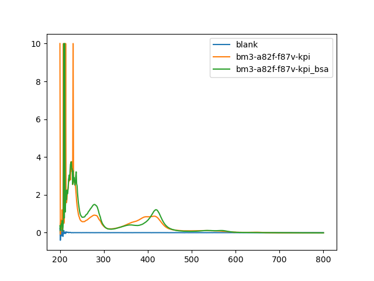

# a82f/f87v : bsa stability

## aim
measure effect of 0.1% bsa on:
- assay/signal stability over time @ room temp
- kd

## procedure
```design/sample-cpds.py``` used to diversity sample 24 compounds from fda lib - expectation that different chemical propertes may respond differently kd-wise.
protein target: bm3 a82f/f87v (promiscuous)
Limitation: the sampled set are not likely to all be binders, so there is limited value in terms of kd shift. the solution to that is to select known binders using lauras' data (if there's enough compound left) in the next round
silver lining: it's a good dry run for next run, first time using the updated ```echo``` package. some of the compounds were depleted so there is an exceptions report that needs a processing method in ```echo```.

```design/make-picklists.py``` uses ```echo``` to generate the picklists.

8th June - compounds dispensed with echo, 

9th June: measurement
target protein thawed (n65 in freezer) and kept on ice
conc measurement:

```python
In [1]: import uv

In [2]: data = uv.BM3('20210609_prot_conc_check1.csv')

In [3]: data
Out[3]: <uv.uv.BM3 at 0x7f9d85c48310>

In [4]: data.concs
Out[4]:
baseline                 0.000000
bm3_a82f_f87v_5in1000    5.521002
Name: P450 conc/uM, dtype: float64

In [6]: 5.521002 * 200
Out[6]: 1104.2004

In [17]: (384 * 30 / 2)/ 1000 # total vol / ml
Out[17]: 5.76

In [7]: def v1(c1, v2, c2):
   ...:     return (v2*c2)/c1


In [19]: v1(1104.2004, 8, 10) * 1000 # µl
Out[19]: 72.45061675398777
```
did dilutions
```python
In [20]: data2=uv.BM3('20210609_prot_conc_check2.csv')

In [21]: data2.concs
Out[21]:
blank                     0.000000
bm3-a82f-f87v-kpi         8.911012 # mixed spin
bm3-a82f-f87v-kpi_bsa    12.831851
Name: P450 conc/uM, dtype: float64
```

that's strange because the buffers were made from the same kpi stock. possible causes:
- glycerol / fatty acid contamination in kpi bottle
- bsa binds to contaminant in protein
given that the starting stock was mixed spin, I'm leaning towards option 2. 


#### plate allocations:
- p1: bsa-blank
- p2: bsa-bm3
- p3: kpi-bm3
- p4: kpi-blank


### time points
- 0h - 11am
- 1h - 12
- 2h - 1pm
- 3h - 2pm
- 4h - 3pm


### data 

### analysis
