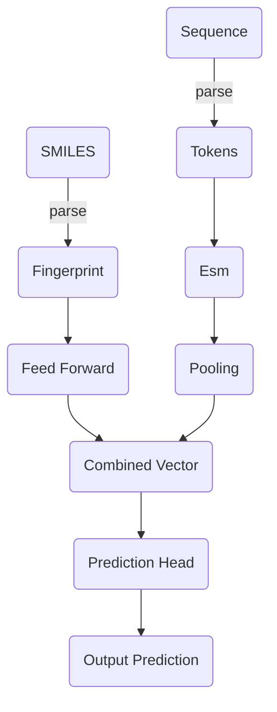

# Model

## Summary

$$
P_{binding} = fn(sequence, smiles)
$$

This page describes the deep learning model constructed for this project.
The model is designed to estimate the likelihood of a binding interaction between a given Cytochrome P450 sequence and a ligand SMILES code.
The intended end uses of the model are:

1. Virtually screening sequences for potential activity with a given compound.
2. Optimally design an enzyme-ligand screening experiment.

## Aim

- [ ] Build and train a model that: 
	- [x] Takes input enzyme sequence and a compound SMILES and outputs an estimate of binding likelihood interaction between the two.
- [ ] Pre-train prototype on large sequence-smiles dataset and save weights.
	- [x] Set up GPU machine
	- [ ] Run for $n$ iterations, save weights
	- [ ] Run again with validation
	- [ ] Outputs uncertainty

## Approach

### Recommender Systems

Abstractly, the problem of predicting the binding likelihood between a one of $m$ proteins and one of $n$ small molecules can be likened to filling empty the values of an $n \times m$ matrix, where rows and columns refer to proteins and small molecules and values are the probability of a binding interaction between the two:

\begin{matrix} 
 & compound_i & compound_{i+1} & ... & compound_{i+n} \\
sequence_i  & P_{binding_{i,j}} &  &  & \\  
sequence_{i+1} &  & \ddots &  &  \\
 \vdots &  &  & \ddots &  \\
sequence_{i+m} &  &  &  &  \ddots \\
\end{matrix}

Some $P_{binding}$ values are known, which in the perspective of $n \times m$ possible values where $n$ and $m$ approach infinity, coverage is sparse.

This type of problem has been addressed in recommender systems, which in the context of streaming services translates to a matrix of $n$ users and $m$ peices of content.
Known values are likes and engagement metrics and are similarly sparse, and blanks can be filled with the probability of a successful recommendation.

Machine learning models can be trained to predict the unknown values based on a numerical representation of the user and content.
The prediction can be cast as a classification problem.
To overcome the lack of negative data points, presumed negative data can be generated by sampling a random user: content pair, which should be treated with caution.

In this work, a machine learning model classifies pairs of protein sequence and small molecules as binding or not.
Negative samples are generated by randomly sampling a sequence and small molecule, which given the vastness of sequence and chemical space may be reasonable in a large number of cases, though this assumption is treated with caution.
A Binary Cross Entropy loss function is employed here where true positives and synthesized negatives are weighted evenly.

!!! info
	Binary Cross Entropy (BCE) is a common machine learning loss function where binary classification is concerned.

	From torch docs:

	$$
	    \ell(x, y) = L = \{l_1,\dots,l_N\}^\top, \quad
	    l_n = - w_n \left[ y_n \cdot \log x_n + (1 - y_n) \cdot \log (1 - x_n) \right],
	$$

	$$
	    \ell(x, y) = \begin{cases}
		\operatorname{mean}(L), & \text{if reduction} = \text{mean;}\\
		\operatorname{sum}(L),  & \text{if reduction} = \text{sum.}
	    \end{cases}
	$$

### Transfer Learning

Transfer learning is a phenomenon where a model trained on one task, can be re-trained on a different domain-related task  sample-efficiently compared to an untrained model.
For example an object detection model trained from from images of vehicles can transfer efficiently to identification of cell phenotypes from microscopy images.
This is because some learned features generalize well enough to be useful in other tasks, reducing the number is samples required to reach a baseline performance level.

In the domain of protein sequence-based machine learning, thoroughly pre-trained models are available for generating a neural embedding of a given protein that can improve sample efficiency in downstream learning tasks.
Generally, these models are large attention-based models trained *unsupervised* on a large corpus of protein sequences, like the *TrEMBL* collection of *Uniprot*.
In this case, unsupervised training often entails reconstruction of a distorted or masked protein sequence and is run on hardware far beyond the budget of this project.

#### The TAPE Benchmark

Tasks Assessing Protein Embeddings (TAPE)[@tape2019] is a benchmark for comparing numerical representations of protein sequence (learned or otherwise) on a set of biological learning tasks from different domains of protein science. 
It currently contains five tasks:

1. **Secondary Structure Prediction Task:**
2. **Structural Contact Prediction Task:**
3. **Remote Homology Detection:**
4. **Flourescent Protein Landscape Prediction:**
5. **Protein Stability Landscape Prediction:**

#### Facebook AI Research - Evolutionary-Scale Modelling
[@rives2021biological]

## Data

Small molecules are represented as SMILES codes in the dataset, which are parsed using `rdkit` and then into 2048 bit fingerprint vectors using the `RdkitFingerprint`.
Molecular fingerprints are generated by hashing functions based on an input molecule such that similar molecules are assigned similar fingerprints, which makes them useful in featurizing small molecules for machine learning tasks.
The fingerprints are represented as a $b \times 2048$ tensor where $b$ is batch size.

Sequences are represented in the dataset as strings where each character $c_i$ is a single letter amino acid code:

$$c_i \subset{ACDEFGHIKLMNPQRSTVWY}$$

Roughly, characters are encoded as tensors of the integers that index their position in the list $\begin{bmatrix} ACDEFGHIKLMNPQRSTVWY\end{bmatrix}$, with extra positions to represent null values, start of frame and end of frame characters.

### Pre-Training Data

### Training Data

## Model Architecture

The model aims to predict:
$$
P_{binding} = fn(sequence, smiles)
$$
Where $fn$ is a model that takes an input of a protein $sequence$ and a prospective ligands' SMILES code - $smiles$ and outputs $P_{binding}$ - an estimate of the probability that the given $sequence$ and $smiles$ bind to one another.

Given their prior success in chemical and protein sequence learning, a neural network model was chosen to build  $fn$.
The network can be split into three parts:

- **Sequence Embedding:** For a given protein $sequence$, output a tensor encoding a neural embedding $z_{sequence}$.
- **Chemical Embedding:** For a given chemical $smiles$ encoding, outputs an embedding $z_{smiles}$.
- **Prediction Head:** For the embeddings $z_{smiles}$ and $z_{sequence}$, output a prediction $P_{binding}$.

### Sequence Embedding
### Chemical Embedding
### Prediction Head

## Training

## Active Learning

\bib
