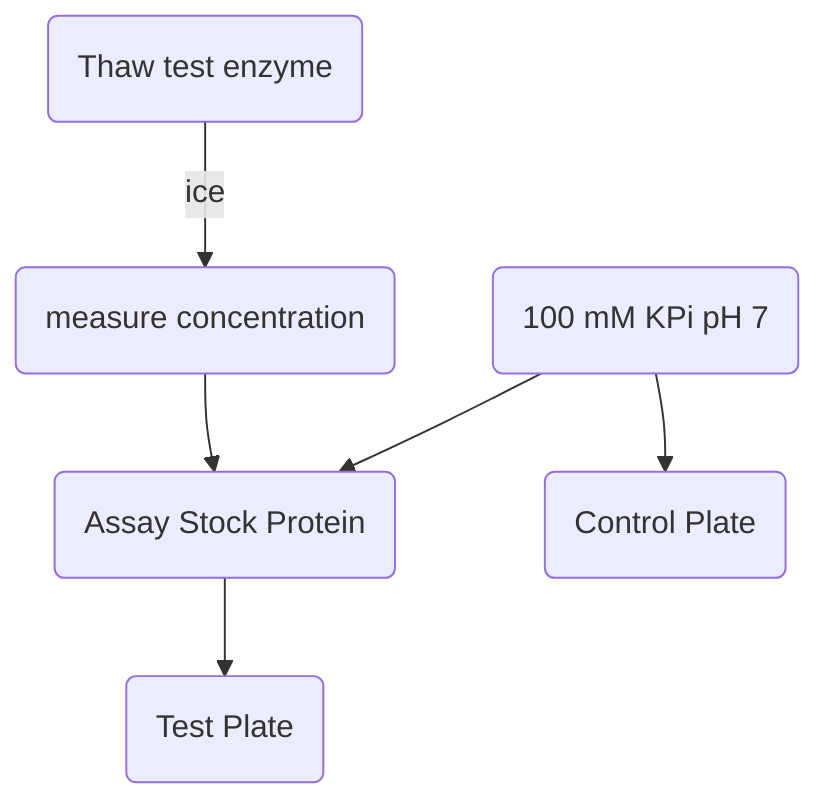

# Protocol - P450 Binding Assay

## Summary

This is a assay protocol for detecting binding interactions between a Cytochrome P450 and multiple small molecule compounds.
The assay has demonstrated scale to a library of 980 compounds and five P450 mutants and with some small adjustments could be improved in scale and precision.

It works in 384 well microplates and uses a microplate reader to capture absorbance profiles from 220-800 nm wavelengths, from which a pattern associated with a P450-small molecule binding interactions can be detected and quantified.  

It was designed for profiling and modelling the effect of mutations on a P450's substrate binding preferences.
This was tested with five P450 mutants against 980 drug-like compounds.
It requires purified P450 protein which limits the rate of data generation, though can scale to more compounds.

## Aim

- **Identify or quantify Cytochrome P450 binding with small molecule ligands:** 
by measuring changes in the UV-Visible light absorbance profile of the P450:ligand complex.
- **Throughput:** scalable to 1000s of compounds.
- **Accuracy and precision:** ideally both.

## Requirements

### Essential

- **Hardware:**
	- **Microplate reader:** Able to read absorbance for all wavelengths between 220 and 800 nm.
	Used here: *BMG ClarioStar & FluoStar* microplate readers.
	- ***Labcyte Echo [500 550]*:** Acoustic liquid handlers for precise compound dispensing.
- **Consumables:**
	In absence of a high precision liquid handling machine, serial dilution of compounds would probably be fine.
	- **Enzyme:** A purified Cytochrome P450 - used here were mutants of P450 BM3 at ~800 µM. 
	Note that BM3 is fairly stable at room temperature which facilitates queuing large batches of plates to the plate reader.
	You could run the assay at a low temperature if you use a solvent other than DMSO, which freezes at 19ºC, which interferes with measurement.
	- **Compound Library:** A large number of compounds in solvent (e.g. DMSO) in a microplate format.
	Used here was a 980 compound library, dissolved at 10 mM in DMSO in 96 well format.
	- **Buffer:** must be optically clear the protein must be stable in it.
	Must not contain potential ligands.
	Used here was 100 mM Potassium Phosphate at pH 7.0 - chosen based on traditional wisdom.
	- **384 well microplates - clear bottom:**
	Assay plates with at least 30 µl working volume. 
	Some treated surfaces may be more suitable for unstable proteins.
	Ideally have minimal absorbance in the 390-420 nm region, but this can be corrected for with controls.
	Used here: *ThermoFisher Nunc 384 Well Plates*
	- **384 well *Labcyte Echo* source plates:** for dispensing compounds to assay plates. 
	Used here were the *Low Dead Volume (LDV)* variety, which have a working volumne of 2.5-12.5 µl, 
	which limits compound waste compared to the standard *Echo* plates (12-65 µl i think?).

### Optional

- **Hardware:**
	- **Bulk liquid dispensing:** can be far more accurate than a multichannel pipette when dispensing protein or buffer into wells.
	During development, both a *ThermodropMulti* peristaltic dispenser and a *Hamilton Star* liquid handling robot. 
	Both work well.
	- **Microplate reader plate loader:** Autoloading plates into the reader increases throughput capacity significantly.
	I used a **BMG ClarioStar** plate reader with a stacker module.
- **Consumables:**
	- **BSA:** in assay buffer may have a stabilizing effect on the enzyme - which would improve time stability and reduce errors.
	Time stability is important for scalability.
	- **384 well Labcyte Echo DMSO Trays:** for control for DMSO concentration in assay wells by topping up each assay plate to a fixed concentration. 
	Around 5% is ok with BM3.

## Procedure

### Summary 

1. **Design *Echo* picklists**
2. **Dispense compounds into *Echo* source plates**
3. **Dispense compounds from *Echo* source plates to empty assay plates**
4. **Stopping point**
5. **Thaw purified P450, make stock of ~ 10 uM in a neutral buffer, enough for 15.36+ ml per plate (40 ul per well)**
6. **Dispense the diluted protein into the assay plates, centrifige etc**
7. **Capture UV-Visible light absorbance data between 220 and 800 nm from plates in a microplate reader at room temperature within 3 hours**
8. **Data analysis**

### Main

1. **Design *Echo* picklists:**
	- An *Echo* can accept a `csv` file with column headers: `Transfer Volume`, `Volume`, `Destination Well`, `Source Well` and optionally: `Destination Plate Name` and `Source Plate Name`.
	The Volume must be in nanolitres and a multiple of 2.5 and the Source and Destination wells must be in the format `[A-Z][0-9]+` and exist in the plate layout specified to the *Echi* client at runtime.
	- The picklist(s) can be generated in a spreadsheet exported to `.csv` or programaticly.
	Documentation for the `python` tools used are [documented here.](picklists.md)

2. **Dispense compounds into *Echo* source plates**
	- This can be done with a multichannel pipette, and requires one tip per compound. 
	If the total volume of each compound required is greater than 60 ul then a standard polypropeline *Echo* plate should be used, otherwise a low dead volume plate may be economical
	If not, or for valuable compounds, Low Dead Volume *Echo* may plates should be used.
	These have a working volume of 2.5-12.5 ul, outside of which the *Echo* will refuse to dispense them.
	You may need to dispense the same compounds into multiple source wells and the picklists must be designed accordingly.

3. **Dispense compounds from *Echo* source plates to empty assay plates**
	- Transfer the picklist `.csv` to the *Echo* host computer.
	- Launch the *Echo Plate Reformat* client there:
		1. Create New Protocol 
			- Select Custom Region Definitions
		2. `File` > `Import Regions` and select your picklist `.csv`
		3. **Optional:** Specify the log output in `Options`, simulate with `Run` > `Simulate` 
		4. Save and run, optionally simulating the run first. 
		Multiple copies of a set of destination plates can be specified if the source plates contain sufficient compound volume.

4. **Stopping point:** Length of pause depends on rate of DMSO evaporation from destination/assay plates and the stability of the compounds at the plate storage conditions. 
Plates stored in a stack should limit evaporation rate to an extent, though specialised lids for *Echo* plates that limit DMSO evaporation are available.
Up to 24 hours seems ok.

5. **Thaw purified P450, make stock of ~ 10 uM in a neutral buffer, enough for 15.36+ ml per plate (40 ul per well)**
I heard that thawing fast limits ice crystal formation, which could destroy some protein.
Optionally, in a microcetrifuge, pre-cooled to 4C, spin the protein at 14,000 rpm and carefully transferr to fresh tubes to remove unfolded protein.

	1. Measure the stock concentration of the protein in a UV-Vis spectrometer by taking an absorbance trace from 200-800 nm, diluted in the destination buffer.
	There should be a peak at 420 nm, the height of which can be used to calculate the protein concentration with the following equation:

	$$ [P450]  = a e  $$

       where $a$ is absorbance and $e$ is the extiction coefficient - 95 for P450 BM3 heme domain.
       Use the measured stock concentration of P450 to create a working stock of around 10 uM.
       10uM was chosen because it yeilds a reasonably strong signal when in plates.
       Varying the protein concentration doesn't have a big effect on measurements, so err towards using more.

	2. Dilute in neutral buffer to the target working concentration.
	Filtration through a 22 um syringe filter can remove some precipitates.
	Vacuum filtration can work too but in practice, the protein can pick up binding partners from the filtration equipment contaminants, which can ruin downstream measurements.

!!! Warning
	**Mixed Spin protein:** if the P450 is bound to a substrate it can squash the absorbance peak at 420 nm and raise a peak at 390 nm. 
	This was an issue with BM3 mutants A82F and A82F/F87V which are particularly promiscuous.

	

	In this case, the substrate can be removed from the binding site using a column of a lipophilic resin, I used Lipidex 1000.
	The resin is stored in methanol so it must be washed thoroughly with deionised water before equilibrating with the assay buffer.
	Adding a salt-based buffer while methanol is still present can cause precipitation and block the column.

	The thawed, mixed-spin P450 is added to the column and left at 4ºC for one hour.
	It's advisable to create fresh stocks of assay buffer at this point, since it's possible that a buffer contaminant is the result of the mixed spin.
	Then the protein is flushed from the column with more assay buffer into a clean bijoux and kept on ice.
	Measure the light absorbance between 200 and 800 nm.
	If the procedure was successful then the absorbance peak at 390 nm should have subsided and the peak at 420 nm should be high and useable for calculating the protein concentration.

6. **Dispense the diluted protein into the assay plates, centrifige etc**

	An electric multichannel pipette works ok but accuracy is more limited than with automated dispensing. 
	38 ul of protein working stock needs to be dispensed into each well, which brings the total well volume to 40 ul in cases where the volume of compounds in DMSO in each well is 2 ul.
	If the volume of DMSO in destination wells is not a constant 2 ul, then default to 38 ul of the protein stock.
	The variation in total volume can be corrected for in compound concentration calculations, though the path lenght will vary which affects precision.

	Better than that is a precise bulk liquid handling device.
	I used a *ThermodropMulti* for a while which was fast and accurate.
	Occasionally a nozzle would become blocked either with DMSO ice or precipitates, though the protein still dispensed ok.
	Blockaged can be cleared by disassemling the pump head, coupling a syringe of water to the nozzle and flushing.

	It may be necessary to dispense some control plates, with everything but protein.
	This is useful to correct for the intrinsic absorbance of the plate and buffer, as well as the compounds themselves which sometimes have absorbance at the measurement wavelengths.
	A control set of plates for every protein screen may be unnecessary and expensive. 
	One good one should be ok.

	Centrifuge the plates for 2-5 mins at around 2000 rpm to push the well contents to the bottom.
	This step can also ensure that meniscuses are flat and uniform and remove bubbles.
	If possible, centrifige at room temperature to avoid DMSO ice formation.

7. **Capture UV-Visible light absorbance data between 220 and 800 nm from plates in a microplate reader at room temperature within 3 hours:**

	The protein is fairly stable over the course of 3 hours.
	On a BMG platereader, measurements take about 15 minutes per plate including the data transfer from device to host machine.
	Using an automated plate loader is recommended, for example a BMG Stacker module.
	In that case, put an empty or waste plate on the top of the stack to limit evaporation from the top assay plate.
	The BMG ClarioStar can be instructed not to read the last plate.

	The stacker occasionally jams due to a solenoid error, which can be due to a misaligned stack of plates.
	It is advisable to unstack and restack the plates using the stacker to check for this kind of issue prior to measurement.

8. **Data analysis overview**
   More info [here](data.md).
	1. Export the plate measurement data to a workable format, like `.csv`. 
	   In the BMG Mars software, the operation is simple but on all host machines I've tried it on have been unreasonably slow to open the data files prior to export.
	2. Index the files to their experiments. 
	   I used a `config.yml` file to track this.
	3. **Analysis**
		1. Match compounds to plate well data.
		2. Match the *Echo* exceptions report to wells to find the actual compound volume in each well.
		3. From each trace, subtract its own absorbance $A_{800}$ at 800 nm.
		   This accounts for baseline drift which can be caused by light scattering from precipitates.
		4. If correcting for compound absorbance with control plates, then subtract the absorbance of each test well from each control well.
		   If the actual compound volumes of the test and control don't match up, it can be an issue if the compound interferes with the absorbance in the 390-420 nm region.
		   If the compound absorbance changes predictably then it can be interpolated.
		5. Curves can be smoothed with Gaussian smoothing using `scipy.ndimage.gaussian_filter1d` if necessary.
		   Sources of a jagged curve can be precipitates, which can interfere with downstream analysis.
		6. At this point, changes in the P450 absorbance trace can be identified.
		   Common categories of trace are:
			   - Clean absorbance trace, no shift.
			   - Clean absorbance trace, peak shift from 420 to 390 nm.
			   - Clean absorbance trace, peak shift from 420 to 424 nm.
			   - Compound interference in absorbance trace.
			   - Light scattering in absorbance trace.
		7. For clean traces with a peak shift from 420 to 390 or 424 nm, biding response can be calculated using the $|\Delta A{390}| - |\Delta A_{420}|$ or $|\Delta A{420}| - |\Delta A_{420}|$  for each compound concentration.
		   With a set of concentration-response data points, the binding dissosciation constant $K_d$ can be calculated using the Michaelis-Menten equation for enzyme kinetics:

		   $$ Response = \frac{V_{max} \times [S]}{K_{d} + [S]}$$
		   $$ Response = |\Delta A_{390}| - |\Delta A_{420}| $$

		   Where $[S]$ is a given substrate concentration and $V_{max}$ is the maximum response magnitude possible from the P450 being tested from this compound.
		   The metrics $K_d$ and $V_{max}$ can be derived by fitting $|\Delta A{390}| - |\Delta A_{420}|= \frac{V_{max} \times [S]}{K_{d} + [S]}$ can be fit to the P450 substrate concentration-response  data points using a curve fit algorithm like `scipy.optimize.curve_fit`.

		   Useful additional metrics for each compound are $R^2$ score of the curve fit, a data quality metric. 

		   An ideal end output of this analysis as a table of compounds, P450s and a qualification or quantification of their binding interactions.

		   Documentation on how I implemented this is [here](data.md)
